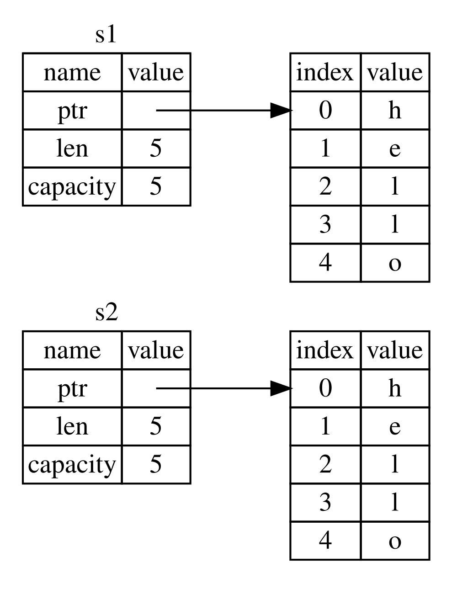

## 所有権とは？

*所有権*とは、Rustプログラムがメモリをどのように管理するかを支配している、規則の集合です。

全てのプログラムは、実行中にコンピュータのメモリの使用方法を管理する必要があります。プログラムが動作するにつれて、
定期的に使用されていないメモリを検索するガベージコレクションを持つ言語もありますが、他の言語では、
プログラマが明示的にメモリを確保したり、解放したりしなければなりません。Rustでは第3の選択肢を取っています: 
メモリは、コンパイラがチェックする一定の規則とともに所有権システムを通じて管理されています。
規則のうちどれかひとつにでも違反すれば、プログラムはコンパイルできないでしょう。
どの所有権機能も、実行中にプログラムの動作を遅くすることはないでしょう。

所有権は多くのプログラマにとって新しい概念なので、慣れるまでに時間がかかります。
嬉しいことに、Rustと、所有権システムの規則の経験を積んでいくにつれて、
自然に安全かつ効率的なコードを構築するのはだんだん簡単だと思えるようになるでしょう。
その調子でいきましょう！

所有権を理解した時、Rustを際立たせる機能の理解に対する強固な礎を得ることになるでしょう。この章では、
非常に一般的なデータ構造に着目した例を取り扱うことで所有権を学んでいきます: 文字列です。

> ### スタックとヒープ
>
> 多くのプログラミング言語において、スタックとヒープについて考える機会はそう多くないでしょう。
> しかし、Rustのようなシステムプログラミング言語においては、値がスタックに積まれるかヒープに置かれるかは、
> 言語の振る舞いや、特定の決断を下す理由などに影響を与えるのです。
> この章の後半でスタックとヒープを交えて所有権の一部が解説されるので、ここでちょっと予行演習をしておきましょう。
>
> スタックもヒープも、実行時にコードが使用できるメモリの一部になりますが、異なる手段で構成されています。
> スタックは、得た順番に値を並べ、逆の順で値を取り除いていきます。これは、
> *last in, first out*（後入れ先出し）と呼ばれます。
> お皿の山を思い浮かべてください: お皿を追加する時には、山の一番上に置き、お皿が必要になったら、一番上から1枚を取り去りますよね。
> 途中や一番下に追加したり、取り除いたりすることもできません。データを追加することを*スタックにpushする*、データを取り除くことを*スタックからpopする*と表現します。
> スタック上のデータは全て既知の固定サイズでなければなりません。
> コンパイル時にサイズがわからなかったり、サイズが可変のデータについては、代わりにヒープに格納しなければなりません。
>
> ヒープは、もっとごちゃごちゃしています: ヒープにデータを置く時、あるサイズのスペースを求めます。
> メモリアロケータはヒープ上に十分な大きさの空の領域を見つけ、使用中にし、*ポインタ*を返します。ポインタとは、その場所へのアドレスです。
> この過程は、*ヒープに領域を確保する（allocating on the heap）*と呼ばれ、単に*allocateする*、つまり「メモリを確保する」と表現することもあります。
> (スタックに値を積むことは、メモリ確保とは考えられません)。ヒープへのポインタは、既知の固定サイズなので、
> スタックに保管することができますが、実データが必要になったら、ポインタを追いかける必要があります。
> レストランで席を確保することを考えましょう。入店したら、グループの人数を告げ、
> 店員が全員座れる空いている席を探し、そこまで誘導します。もしグループの誰かが遅れて来るのなら、
> 着いた席の場所を尋ねてあなたを発見することができます。
>
> スタックにデータを積むほうが、ヒープ上にメモリを確保するより高速です。
> アロケータが新しいデータを置くための場所を探さなくていいからです。というのも、その場所は常にスタックの一番上だからですね。
> それと比べて、ヒープ上にメモリを確保するのはより手間の多い仕事です。
> アロケータはまずデータを入れるのに充分な大きさの場所を探して、そして次のメモリ確保に備えて予約をしないといけないからです。
>
> ヒープへのデータアクセスは、スタックのデータへのアクセスよりも低速です。
> ポインタを追って目的の場所に到達しなければならないからです。現代のプロセッサは、メモリをあちこち行き来しなければ、
> より速くなります。似た例えを続けましょう。レストランで多くのテーブルから注文を受ける給仕人を考えましょう。最も効率的なのは、
> 次のテーブルに移らずに、一つのテーブルで全部の注文を受け付けてしまうことです。テーブルAで注文を受け、
> それからテーブルBの注文、さらにまたA、それからまたBと渡り歩くのは、かなり低速な過程になってしまうでしょう。
> 同じ意味で、プロセッサは、
> データが隔離されている(ヒープではそうなっている可能性がある)よりも近くにある(スタックではこうなる)ほうが、
> 仕事をうまくこなせるのです。
>
> コードが関数を呼び出すと、関数に渡された値(ヒープのデータへのポインタも含まれる可能性あり)と、
> 関数のローカル変数がスタックに載ります。関数の実行が終了すると、それらの値はスタックから取り除かれます。
>
> どの部分のコードがどのヒープ上のデータを使用しているか把握すること、ヒープ上の重複するデータを最小化すること、
> メモリ不足にならないようにヒープ上の未使用のデータを掃除することは全て、所有権が解決する問題です。
> 一度所有権を理解したら、あまり頻繁にスタックとヒープに関して考える必要はなくなるでしょうが、
> 所有権の主な目的はヒープデータを管理することだと知っていると、所有権がどうしてこうなっているのか説明するのに役立つこともあります。
>

### 所有権規則

まず、所有権の規則について見ていきましょう。
この規則を具体化する例を扱っていく間もこれらの規則を肝に銘じておいてください:

* Rustの各値には、*所有者*が存在する。
* いかなる時も所有者は一つである。
* 所有者がスコープから外れたら、値は破棄される。

### 変数スコープ

もう基本的なRustの文法は通り過ぎたので、`fn main() {`というコードはもう例に含みません。
従って、例をなぞっているなら、これからの例は`main`関数に手動で入れ込むようにしてください。
結果的に、例は少々簡潔になり、定型コードよりも具体的な詳細に集中しやすくなります。

所有権の最初の例として、何らかの変数の*スコープ*について見ていきましょう。スコープとは、
要素が有効になるプログラム内の範囲のことです。以下の変数を例に取ります:

```rust
let s = "hello";
```

変数`s`は、文字列リテラルを参照し、ここでは、文字列の値はプログラムのテキストとしてハードコードされています。
この変数は、宣言された地点から、現在の*スコープ*の終わりまで有効になります。リスト4-1には、
変数`s`が有効な場所に関する注釈がコメントで付記されたプログラムを示します。

```rust
{{#rustdoc_include ../listings/ch04-understanding-ownership/listing-04-01/src/main.rs:here}}
```

<span class="caption">リスト4-1: 変数と有効なスコープ</span>

言い換えると、ここまでに重要な点は二つあります:

* `s`がスコープに*入る*と、有効になる。
* スコープを*抜ける*まで、有効なまま。

今のところ、スコープと、変数が有効である期間の関係は、他の言語のそれに類似しています。さて、この理解のもとに、
`String`型を導入して構築していきましょう。

### `String`型

所有権の規則を具体化するには、第3章の[「データ型」][data-types]節で講義したものよりも、より複雑なデータ型が必要になります。
以前講義した型は、既知のサイズを持ち、スタックに置いておいてスコープが終わるとスタックから取り除かれるという扱いが可能でした。
さらに、コードの別の場所で同じ値を異なるスコープを持たせて使う必要があるなら、
新しい、独立したインスタンスに、高速に、そして自明にコピーすることができました。
が、ヒープに確保されるデータ型を観察して、
コンパイラがどうそのデータを掃除すべきタイミングを把握しているかを掘り下げていきたいと思います。
`String`型はその好例です。

`String`型の所有権にまつわる部分に着目しましょう。
またこの観点は、標準ライブラリから提供されたか自分で作成したかを問わず、他の複雑なデータ型にも適用されます。
`String`型については、[第8章][ch8]でより深く議論します。

既に文字列リテラルは見かけましたね。文字列リテラルでは、文字列の値はプログラムにハードコードされます。
文字列リテラルは便利ですが、テキストを使いたいかもしれない場面全てに最適なわけではありません。一因は、
文字列リテラルが不変であることに起因します。別の原因は、コードを書く際に、全ての文字列値が判明するわけではないからです:
例えば、ユーザ入力を受け付け、それを保持したいとしたらどうでしょうか？このような場面用に、Rustには、
2種類目の文字列型、`String`型があります。この型はヒープにメモリを確保するので、
コンパイル時にはサイズが不明なテキストも保持することができるのです。`from`関数を使用して、
文字列リテラルから`String`型を生成できます。以下のように:

```rust
let s = String::from("hello");
```

この二重コロン`::`演算子は、`string_from`などの名前を使うのではなく、
`String`型直下の`from`関数を特定する働きをします。この記法について詳しくは、
第5章の[「メソッド記法」][method-syntax]節と、第7章の[「モジュールツリーの要素を示すためのパス」][paths-module-tree]でモジュールを使った名前空間分けについて話をするときに議論します。

この種の文字列は、変更することが*できます*:

```rust
{{#rustdoc_include ../listings/ch04-understanding-ownership/no-listing-01-can-mutate-string/src/main.rs:here}}
```


では、ここでの違いは何でしょうか？なぜ、`String`型は変更できるのに、リテラルはできないのでしょうか？
違いは、これら二つの型がメモリを扱う方法にあります。

### メモリと確保

文字列リテラルの場合、中身はコンパイル時に判明しているので、テキストは最終的なバイナリファイルに直接ハードコードされます。
このため、文字列リテラルは、高速で効率的になるのです。しかし、これらの特性は、
その文字列リテラルの不変性にのみ端を発するものです。残念なことに、コンパイル時にサイズが不明だったり、
プログラム実行に合わせてサイズが可変なテキスト片用に一塊のメモリをバイナリに確保しておくことは不可能です。

`String`型では、可変かつ伸長可能なテキスト破片をサポートするために、コンパイル時には不明な量のメモリを
ヒープに確保して内容を保持します。つまり:

* メモリは、実行時にメモリアロケータに要求される。
* `String`型を使用し終わったら、アロケータにこのメモリを返還する方法が必要である。

この最初の部分は、既にしています: `String::from`関数を呼んだら、その実装が必要なメモリを要求するのです。
これは、プログラミング言語において、極めて普遍的です。

しかしながら、2番目の部分は異なります。*ガベージコレクタ*(GC)付きの言語では、GCがこれ以上、
使用されないメモリを検知して片付けるため、プログラマは、そのことを考慮する必要はありません。
GCを持たない言語の多くでは、メモリがもう使用されないことを見計らって、明示的に解放するコードを呼び出すのは、
プログラマの責任になります。ちょうど要求の際にしたようにですね。これを正確にすることは、
歴史的にも難しいプログラミング問題の一つであり続けています。もし、忘れていたら、メモリを無駄にします。
タイミングが早すぎたら、無効な変数を作ってしまいます。2回解放してしまっても、バグになるわけです。
`allocate`と`free`は完璧に1対1対応にしなければならないのです。

Rustは、異なる道を歩んでいます: ひとたび、メモリを所有している変数がスコープを抜けたら、
メモリは自動的に返還されます。こちらの例は、
リスト4-1のスコープ例を文字列リテラルから`String`型を使うものに変更したバージョンになります:

```rust
{{#rustdoc_include ../listings/ch04-understanding-ownership/no-listing-02-string-scope/src/main.rs:here}}
```

`String`型が必要とするメモリをアロケータに返還することが自然な地点があります: `s`変数がスコープを抜ける時です。
変数がスコープを抜ける時、Rustは特別な関数を呼んでくれます。この関数は、[`drop`][drop]と呼ばれ、
ここに`String`型の書き手はメモリを返還するコードを配置することができます。Rustは、閉じ波括弧で自動的に`drop`関数を呼び出します。

> 注釈: C++では、要素の生存期間の終了地点でリソースを解放するこのパターンを時に、
> *RAII*(Resource Aquisition Is Initialization: リソースの獲得は、初期化である)と呼んだりします。
> Rustの`drop`関数は、あなたがRAIIパターンを使ったことがあれば、馴染み深いものでしょう。

このパターンは、Rustコードの書かれ方に甚大な影響をもたらします。現状は簡単そうに見えるかもしれませんが、
ヒープ上に確保されたデータを複数の変数に使用させるようなもっと複雑な場面では、コードの振る舞いは、
予期しないものになる可能性もあります。これから、そのような場面を掘り下げてみましょう。

#### ムーブによる変数とデータの相互作用

Rustにおいては、複数の変数が同じデータに対して異なる手段で相互作用することができます。
整数を使用したリスト4-2の例を見てみましょう。

```rust
{{#rustdoc_include ../listings/ch04-understanding-ownership/listing-04-02/src/main.rs:here}}
```

<span class="caption">リスト4-2: 変数`x`の整数値を`y`に代入する</span>

もしかしたら、何をしているのか予想することができるでしょう: 
「値`5`を`x`に束縛する; それから`x`の値をコピーして`y`に束縛する。」これで、
二つの変数(`x`と`y`)が存在し、両方、値は`5`になりました。これは確かに起こっている現象を説明しています。
なぜなら、整数は既知の固定サイズの単純な値で、これら二つの`5`という値は、スタックに積まれるからです。

では、`String`バージョンを見ていきましょう:

```rust
{{#rustdoc_include ../listings/ch04-understanding-ownership/no-listing-03-string-move/src/main.rs:here}}
```

このコードは酷似していますので、動作方法も同じだと思い込んでしまうかもしれません:
要するに、2行目で`s1`の値をコピーし、`s2`に束縛するということです。ところが、
これは全く起こることを言い当てていません。

図4-1を見て、ベールの下で`String`に何が起きているかを確かめてください。
`String`型は、左側に示されているように、3つの部品でできています: 
文字列の中身を保持するメモリへのポインタと長さ、そして、許容量です。この種のデータは、スタックに保持されます。
右側には、中身を保持したヒープ上のメモリがあります。 


<span class="caption">図4-1: `s1`に束縛された`"hello"`という値を保持する`String`のメモリ上の表現</span>

長さは、`String`型の中身が現在使用しているメモリ量をバイトで表したものです。許容量は、
`String`型がアロケータから受け取った全メモリ量をバイトで表したものです。長さと許容量の違いは問題になることですが、
この文脈では違うので、とりあえずは、許容量を無視しても構わないでしょう。 

`s1`を`s2`に代入すると、`String`型のデータがコピーされます。つまり、スタックにあるポインタ、長さ、
許容量をコピーするということです。ポインタが指すヒープ上のデータはコピーしません。言い換えると、
メモリ上のデータ表現は図4-2のようになるということです。


<span class="caption">図4-2: `s1`のポインタ、長さ、許容量のコピーを保持する変数`s2`のメモリ上での表現</span>

メモリ上の表現は、図4-3のようにはなり*ません*。これは、
Rustが代わりにヒープデータもコピーするという選択をしていた場合のメモリ表現ですね。Rustがこれをしていたら、
ヒープ上のデータが大きい時に`s2 = s1`という処理の実行時性能がとても悪くなっていた可能性があるでしょう。



<span class="caption">図4-3: Rustがヒープデータもコピーしていた場合に`s2 = s1`という処理が行なった可能性のあること</span>

先ほど、変数がスコープを抜けたら、Rustは自動的に`drop`関数を呼び出し、
その変数が使っていたヒープメモリを片付けると述べました。しかし、図4-2は、
両方のデータポインタが同じ場所を指していることを示しています。これは問題です: `s2`と`s1`がスコープを抜けたら、
両方とも同じメモリを解放しようとします。これは*二重解放*エラーとして知られ、以前触れたメモリ安全性上のバグの一つになります。
メモリを2回解放すると、意図しないメモリ書き換えなどのメモリ破壊（memory corruption）につながり、
セキュリティ上の脆弱性を生む可能性があります。

メモリ安全性を保証するために、`let s2 = s1;`の行の後、コンパイラは`s1`が最早有効ではないとみなします。
故に`s1`がスコープを抜けた際に何も解放する必要がなくなるわけです。`s2`の生成後に`s1`を使用しようとしたら、
どうなるかを確認してみましょう。動かないでしょう:

```rust,ignore,does_not_compile
{{#rustdoc_include ../listings/ch04-understanding-ownership/no-listing-04-cant-use-after-move/src/main.rs:here}}
```

コンパイラが無効化された参照は使用させてくれないので、以下のようなエラーが出るでしょう:

```console
{{#include ../listings/ch04-understanding-ownership/no-listing-04-cant-use-after-move/output.txt}}
```

他の言語を触っている間に*shallow copy*と*deep copy*という用語を耳にしたことがあるなら、
データのコピーなしにポインタと長さ、許容量をコピーするという概念は、shallow copyすることのように思えるかもしれません。
ですが、コンパイラは最初の変数をも無効化するので、shallow copyと呼ばれる代わりに、
*ムーブ*として知られているわけです。この例では、`s1`は`s2`に*ムーブ*されたと表現するでしょう。
以上より、実際に起きることを図4-4に示してみました。


<span class="caption">図4-4: `s1`が無効化された後のメモリ表現</span>

これにて一件落着です。`s2`だけが有効なので、スコープを抜けたら、それだけがメモリを解放して、
終わりになります。

付け加えると、これにより暗示される設計上の選択があります: Rustでは、
自動的にデータの"deep copy"が行われることは絶対にないわけです。それ故に、あらゆる*自動*コピーは、実行時性能の観点で言うと、
悪くないと考えてよいことになります。

#### スコープと代入

スコープ、所有権、そして`drop`関数によるメモリ解放の関係については、逆向きのことも成り立ちます。既存の変数へまったく新しい値を代入すると、Rustは`drop`を呼び出し、元の値が使っていたメモリをただちに解放します。たとえば、次のコードを考えてみてください。

```rust
{{#rustdoc_include ../listings/ch04-understanding-ownership/no-listing-04b-replacement-drop/src/main.rs:here}}
```

最初に変数`s`を宣言し、値`"hello"`を持つ`String`へ束縛しています。続いて、値`"ahoy"`を持つ新しい`String`を作り、それを`s`へ代入します。この時点で、ヒープ上の元の値を参照するものは何もありません。現在のスタックとヒープの状態を図4-5に示します。


<span class="caption">図4-5: 最初の値が完全に置き換えられた後のメモリ表現</span>

したがって、元の文字列はただちにスコープから外れます。Rustはその値に対して`drop`関数を実行し、メモリをすぐに解放します。最後に値を表示すると、`"ahoy, world!"`になります。

#### クローンによる変数とデータの相互作用

仮に、スタック上のデータだけでなく、*本当に*`String`型のヒープデータのdeep copyが必要ならば、
`clone`と呼ばれるよくあるメソッドを使うことができます。メソッド記法については第5章で議論しますが、
メソッドは多くのプログラミング言語に見られる機能なので、以前に見かけたこともあるんじゃないでしょうか。

これは、`clone`メソッドの動作例です:

```rust
{{#rustdoc_include ../listings/ch04-understanding-ownership/no-listing-05-clone/src/main.rs:here}}
```

これは問題なく動作し、図4-3で示した動作を明示的に生み出します。ここでは、
ヒープデータが*実際に*コピーされています。

`clone`メソッドの呼び出しを見かけたら、何らかの任意のコードが実行され、その実行コストは高いと把握できます。
何か違うことが起こっているなと見た目でわかるわけです。

#### スタックのみのデータ: コピー

まだ話題にしていない別の問題があります。
この整数を使用したコードは、一部をリスト4-2で示しましたが、うまく動作する有効なものです:

```rust
{{#rustdoc_include ../listings/ch04-understanding-ownership/no-listing-06-copy/src/main.rs:here}}
```

ですが、このコードは一見、今学んだことと矛盾しているように見えます:
`clone`メソッドの呼び出しがないのに、`x`は有効で、`y`にムーブされませんでした。

整数のように、コンパイル時にサイズが分かる型は値全体がスタック上に置かれるため、実際の値をすばやくコピーできます。したがって、変数`y`を作った後に`x`を無効にする必要がありません。言い換えると、この場合にはshallow copyとdeep copyの違いがなく、`clone`を呼び出しても通常のコピーと異なる処理にはなりません。そのため、`clone`を省略できます。

Rustには`Copy`トレイトと呼ばれる特別な注釈があり、
整数のようなスタックに保持される型に対して配置することができます(トレイトについては[第10章][traits]でもっと詳しく話します)。
型が`Copy`トレイトを実装していれば、その型を持つ変数はムーブされず、代わりに単純な方法でコピーされます。
そのため、他の変数に代入した後でも、元の変数は有効なままです。

> **補足**
>
> `x`がムーブされずコピーされる直接の理由は、`i32`型が`Copy`トレイトを実装していることです。「プリミティブ型だから」や「スタックに置かれるから」というだけで決まるわけではありません。スタック上の値をビット単位で複製しても、所有権や解放処理が重複しない型だからこそ、`Copy`を実装できます。一方、`String`のスタック上の値にはヒープ領域へのポインタなどが含まれます。これだけを単純にコピーすると、2つの`String`が同じヒープ領域を所有しているような状態になり、二重解放につながるため、`String`は`Copy`を実装していません。

> **C言語との比較**
>
> C言語の代入では、構造体を含めて値のビット列がコピーされます。構造体の中にポインタがあれば、ポインタが指す先のデータではなく、アドレスだけがコピーされます。その後の解放責任はプログラマが管理しなければなりません。Rustでは、そのような単純コピーが安全な型にだけ`Copy`を許可し、それ以外の型はムーブまたは明示的な`clone`にします。

コンパイラは、型やその一部分でも`Drop`トレイトを実装している場合、`Copy`による注釈をさせてくれません。
型の値がスコープを外れた時に何か特別なことを起こす必要がある場合に、`Copy`注釈を追加すると、コンパイルエラーが出ます。
型に`Copy`注釈をつけてトレイトを実装する方法について学ぶには、付録Cの[「導出可能なトレイト」][derivable-traits]をご覧ください。

では、どの型が`Copy`トレイトを実装しているのでしょうか？
確実に知るためには、調べたい型のドキュメントをチェックすればいいのですが、
一般規則として、単純なスカラー値の集合は何でも`Copy`を実装でき、メモリ確保が必要だったり、
何らかの形態のリソースだったりするものは`Copy`を実装できません。ここに`Copy`を実装する型の一部を並べておきます。

* あらゆる整数型。`u32`など。
* 論理値型である`bool`。`true`と`false`という値がある。
* あらゆる浮動小数点型、`f64`など。
* 文字型である`char`。
* タプル。ただ、`Copy`の型だけを含む場合。例えば、`(i32, i32)`は`Copy`だが、
`(i32, String)`は違う。

### 所有権と関数

関数に値を渡すことと、値を変数に代入することの仕組みは似ています。関数に変数を渡すと、
代入のようにムーブやコピーされます。リスト4-3は変数がスコープに入ったり、
抜けたりする地点について注釈してある例です。

<span class="filename">ファイル名: src/main.rs</span>

```rust
{{#rustdoc_include ../listings/ch04-understanding-ownership/listing-04-03/src/main.rs}}
```

<span class="caption">リスト4-3: 所有権とスコープが注釈された関数群</span>

`takes_ownership`の呼び出し後に`s`を呼び出そうとすると、コンパイラは、コンパイルエラーを投げるでしょう。
これらの静的チェックにより、ミスを犯さないでいられます。`s`や`x`を使用するコードを`main`に追加してみて、
どこで使えて、そして、所有権規則により、どこで使えないかを確認してください。

### 戻り値とスコープ

値を返すことでも、所有権は移動します。リスト4-4に値を返す関数の例を、リスト4-3と似た注釈を付けて示します。

<span class="filename">ファイル名: src/main.rs</span>

```rust
{{#rustdoc_include ../listings/ch04-understanding-ownership/listing-04-04/src/main.rs}}
```

<span class="caption">リスト4-4: 戻り値の所有権を移動する</span>

変数の所有権は、毎回同じパターンを辿っています: 別の変数に値を代入すると、ムーブされます。
ヒープにデータを含む変数がスコープを抜けると、データの所有権が別の変数にムーブされていない限り、
`drop`により片付けられるでしょう。

これでもいいのですが、所有権を取り、またその所有権を戻す、ということを全ての関数でしていたら、ちょっとめんどくさいですね。
関数に値は使わせるものの所有権を取らないようにさせるにはどうするべきでしょうか。
返したいと思うかもしれない関数本体で発生したあらゆるデータとともに、再利用したかったら、渡されたものをまた返さなきゃいけないのは、
非常に煩わしいことです。

Rustでは、タプルを使って複数の値を返すことができます。リスト4-5のようにですね。

<span class="filename">ファイル名: src/main.rs</span>

```rust
{{#rustdoc_include ../listings/ch04-understanding-ownership/listing-04-05/src/main.rs}}
```

<span class="caption">リスト4-5: 引数の所有権を返す</span>

でも、これでは、大袈裟すぎますし、ありふれているはずの概念に対して、作業量が多すぎます。
私たちにとって幸運なことに、Rustには所有権を移動することなく値を使うための機能があり、*参照*と呼ばれます。

[data-types]: ch03-02-data-types.html#データ型
[ch8]: ch08-02-strings.html
[traits]: ch10-02-traits.html
[derivable-traits]: https://doc.rust-lang.org/book/appendix-03-derivable-traits.html
[method-syntax]: ch05-03-method-syntax.html#メソッド記法
[paths-module-tree]: ch07-03-paths-for-referring-to-an-item-in-the-module-tree.html
[drop]: https://doc.rust-lang.org/std/ops/trait.Drop.html#tymethod.drop
