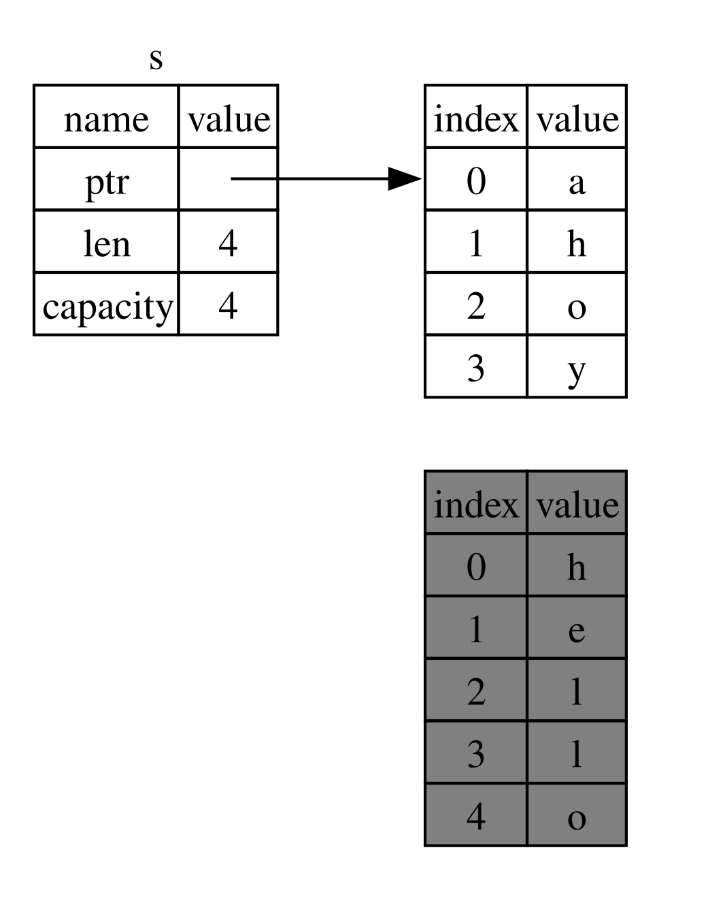

## 参照と借用

リスト4-5のタプルコードの問題は、`String`型を呼び出し元の関数に戻さないと、`calculate_length`を呼び出した後に、
`String`オブジェクトが使えなくなることであり、これは`String`オブジェクトが`calculate_length`にムーブされてしまうためでした。
代わりに、`String`値への参照を渡すことができます。
*参照*はアドレスであり、それを辿ってそのアドレスに置かれているデータにアクセスできるという点で、ポインタと似ています;
データは他の変数によって所有されています。
ポインタと異なる点としては、参照はその生存期間中を通して、特定の型の有効な値を指していることが保証されています。

ここで、値の所有権をもらう代わりに引数としてオブジェクトへの参照を取る`calculate_length`関数を定義し、
使う方法を見てみましょう:

<span class="filename">ファイル名: src/main.rs</span>

```rust
{{#rustdoc_include ../listings/ch04-understanding-ownership/no-listing-07-reference/src/main.rs:all}}
```

まず、変数宣言と関数の戻り値にあったタプルコードは全てなくなったことに気付いてください。
2番目に、`&s1`を`calcuate_length`に渡し、その定義では、`String`型ではなく、`&String`を受け取っていることに注目してください。
これらのアンド記号が参照を表しており、これのおかげで所有権をもらうことなく値を参照することができるのです。
図4-5にこの概念を描写します。



<span class="caption">図4-5: `String s1`を指す`&String s`の図表</span>

> 注釈: `&`による参照の逆は、*参照外し*であり、参照外し演算子の`*`で達成できます。
> 第8章で参照外し演算子の使用例を眺め、第15章で参照外しについて詳しく議論します。

ここの関数呼び出しについて、もっと詳しく見てみましょう:

```rust
{{#rustdoc_include ../listings/ch04-understanding-ownership/no-listing-07-reference/src/main.rs:here}}
```

この`&s1`という記法により、`s1`の値を*参照する*参照を生成することができますが、これを所有することはありません。
所有してないということは、指している値は、参照が使用されなくなってもドロップされないということです。

同様に、関数のシグニチャでも、`&`を使用して引数`s`の型が参照であることを示しています。
説明的な注釈を加えてみましょう:

```rust
{{#rustdoc_include ../listings/ch04-understanding-ownership/no-listing-08-reference-with-annotations/src/main.rs:here}}
```

変数`s`が有効なスコープは通常の関数の引数のものと同じですが、`s`はそれが指す値に対する所有権を持っていないので、
`s`が使用されなくなっても指している値をドロップすることはありません。関数が実際の値の代わりに参照を引数に取ると、
所有権をもらわないので、所有権を返す目的で値を返す必要はありません。

参照を作成することを*借用*と呼びます。現実生活のように、誰かが何かを所有していたら、
それを借りることができます。用が済んだら、返さないといけません。持っているのとは違うのです。

では、借用した何かを変更しようとしたら、どうなるのでしょうか？リスト4-6のコードを試してください。
ネタバレ注意: 動きません！

<span class="filename">ファイル名: src/main.rs</span>

```rust,ignore,does_not_compile
{{#rustdoc_include ../listings/ch04-understanding-ownership/listing-04-06/src/main.rs}}
```

<span class="caption">リスト4-6: 借用した値を変更しようと試みる</span>

これがエラーです:

```console
{{#include ../listings/ch04-understanding-ownership/listing-04-06/output.txt}}
```

変数が標準で不変なのと全く同様に、参照も不変なのです。参照している何かを変更することは叶わないわけです。

### 可変参照

借用された値を変更できるようにするには、代わりに*可変参照*を使うという一捻りを加えるだけでよく、
これでリスト4-6のコードを修正できます:

<span class="filename">ファイル名: src/main.rs</span>

```rust
{{#rustdoc_include ../listings/ch04-understanding-ownership/no-listing-09-fixes-listing-04-06/src/main.rs}}
```

まず`s`が`mut`となるように変更します。次に、`change`関数を呼ぶところで`&mut s`によって可変参照を作成し、
さらに関数シグネチャを、`some_string: &mut String`で可変参照を受け入れるように更新します。
これにより、`change`関数は借用する値を変更しようとすることがとても明確になります。

可変参照には大きな制約が一つあります: ある値への可変参照が存在するなら、その値への参照を他に作ることはできません。
このコードは`s`への可変参照を2個作成しようとしていますが、これは失敗します:

<span class="filename">ファイル名: src/main.rs</span>

```rust,ignore,does_not_compile
{{#rustdoc_include ../listings/ch04-understanding-ownership/no-listing-10-multiple-mut-not-allowed/src/main.rs:here}}
```

これがエラーです:

```console
{{#include ../listings/ch04-understanding-ownership/no-listing-10-multiple-mut-not-allowed/output.txt}}
```

このエラーによると、一度に`s`を可変として2回以上借用することはできないので、このコードは不正だ、とのことです。
最初の可変借用は`r1`にあり、`println!`で使用されるまで続かないといけませんが、この可変借用の作成から使用までの間に、
`r1`と同じデータを借用する別の可変借用を`r2`に作成しようとしました。

同じデータへの複数の可変参照が同時に存在することを禁止する、という制約は、可変化を許可するものの、
それを非常に統制の取れた形で行えます。これは、新たなRustaceanにとっては、
壁です。なぜなら、多くの言語では、いつでも好きな時に可変化できるからです。
この制約がある利点は、コンパイラがコンパイル時にデータ競合を防ぐことができる点です。
データ競合とは、競合状態と類似していて、これら3つの振る舞いが起きる時に発生します:

* 2つ以上のポインタが同じデータに同時にアクセスする。
* 少なくとも一つのポインタがデータに書き込みを行っている。
* データへのアクセスを同期する機構が使用されていない。

データ競合は未定義の振る舞いを引き起こし、実行時に追いかけようとした時に特定し解決するのが難しい問題です。
しかし、Rustは、データ競合が起こるコードのコンパイルを拒否することで、この問題が発生しないようにしてくれるわけです。

いつものように、波かっこを使って新しいスコープを生成し、*同時並行*なものでなく、複数の可変な参照を作ることができます。

```rust
{{#rustdoc_include ../listings/ch04-understanding-ownership/no-listing-11-muts-in-separate-scopes/src/main.rs:here}}
```

コンパイラは可変と不変な参照を組み合わせることに関しても、似たような規則を強制します。このコードはエラーになります:

```rust,ignore,does_not_compile
{{#rustdoc_include ../listings/ch04-understanding-ownership/no-listing-12-immutable-and-mutable-not-allowed/src/main.rs:here}}
```

これがエラーです:

```console
{{#include ../listings/ch04-understanding-ownership/no-listing-12-immutable-and-mutable-not-allowed/output.txt}}
```

ふう！*さらに*不変な参照をしている間は、同じ値に対して可変な参照をすることはできません。

不変参照の使用者は、それ以降に値が突然変わることなんて予想してません！
しかしながら、複数の不変参照をすることは許されています。
データを読み込んでいるだけの人に、他人がデータを読み込むことに対して影響を与える能力はないからです。

参照のスコープは、それが導入されたところから始まり、その参照が最後に使用される時点まで続きます。
例えば、次のコードはコンパイルできるでしょう。不変参照の最後の使用箇所である`println!`は、
可変参照が導入されるよりも前に発生するからです:

```rust,edition2021
{{#rustdoc_include ../listings/ch04-understanding-ownership/no-listing-13-reference-scope-ends/src/main.rs:here}}
```

不変参照`r1`と`r2`のスコープは、それらが最後に使用される`println!`の後で終了します。
これは可変参照`r3`が作成されるより前のことです。これらのスコープは重なっていないので、
このコードは許可されます: コンパイラは、スコープの終了より前の時点で参照がもはや使用されていないということを、
判別できるのです。

借用エラーは、時としてイライラするものではありますが、Rustコンパイラがバグの可能性を早期に指摘してくれ(それも実行時ではなくコンパイル時に)、
問題の発生箇所をズバリ示してくれるのだと覚えておいてください。そうして想定通りにデータが変わらない理由を追いかける必要がなくなります。

### 宙に浮いた参照

ポインタのある言語では、誤ってダングリングポインタを生成してしまいやすいです。ダングリングポインタとは、
他人に渡されてしまった可能性のあるメモリを指すポインタのことであり、その箇所へのポインタを保持している間に、
メモリを解放してしまうことで発生します。対照的にRustでは、コンパイラが、
参照がダングリング参照に絶対ならないよう保証してくれます: つまり、何らかのデータへの参照があったら、
コンパイラは参照がスコープを抜けるまで、データがスコープを抜けることがないよう確認してくれるわけです。

ダングリング参照を作ってみて、コンパイラがどのようにこれをコンパイルエラーで阻止するか見てみましょう:

<span class="filename">ファイル名: src/main.rs</span>

```rust,ignore,does_not_compile
{{#rustdoc_include ../listings/ch04-understanding-ownership/no-listing-14-dangling-reference/src/main.rs}}
```

こちらがエラーです:

```console
{{#include ../listings/ch04-understanding-ownership/no-listing-14-dangling-reference/output.txt}}
```

このエラーメッセージは、まだ講義していない機能について触れています: ライフタイムです。
ライフタイムについては第10章で詳しく議論しますが、ライフタイムに関する部分を無視すれば、
このメッセージは、確かにこのコードが問題になる理由に関する鍵を握っています:

```text
this function's return type contains a borrowed value, but there is no value
for it to be borrowed from
```

`dangle`コードの各段階で一体何が起きているのかを詳しく見ていきましょう:

<span class="filename">ファイル名: src/main.rs</span>

```rust,ignore,does_not_compile
{{#rustdoc_include ../listings/ch04-understanding-ownership/no-listing-15-dangling-reference-annotated/src/main.rs:here}}
```

`s`は、`dangle`内で生成されているので、`dangle`のコードが終わったら、`s`は解放されてしまいますが、
そこへの参照を返そうとしました。つまり、この参照は無効な`String`を指していると思われるのです。
よくないことです！コンパイラは、これを阻止してくれるのです。

ここでの解決策は、`String`を直接返すことです:

```rust
{{#rustdoc_include ../listings/ch04-understanding-ownership/no-listing-16-no-dangle/src/main.rs:here}}
```

これは何の問題もなく動きます。所有権はムーブされ、何も解放されることはありません。

### 参照の規則

参照について議論したことを再確認しましょう:

* 任意のタイミングで、一つの可変参照*か*不変な参照いくつでもの*どちらか*を行える。
* 参照は常に有効でなければならない。

次は、違う種類の参照を見ていきましょう: スライスです。


