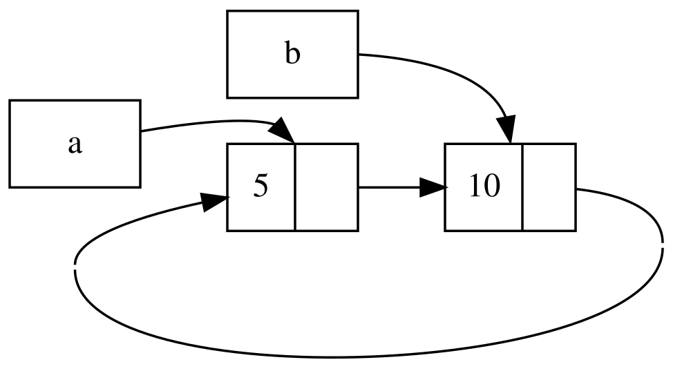

## 循環参照は、メモリをリークすることもある

Rustのメモリ安全保証により誤って絶対に片付けられることのないメモリ(*メモリリーク*として知られています)を生成してしまいにくくなりますが、
不可能にはなりません。メモリリークを完全に回避することは、Rustの保証の一つではなく、
メモリリークはRustにおいてはメモリ安全であることを意味します。
Rustでは、`Rc<T>`と`RefCell<T>`を使用してメモリリークを許可するとわかります。
要素がお互いに循環して参照する参照を生成することも可能ということです。循環の各要素の参照カウントが絶対に0にならないので、
これはメモリリークを起こし、値は絶対にドロップされません。

### 循環参照させる

リスト15-25の`List` enumの定義と`tail`メソッドから始めて、どう循環参照が起こる可能性があるのかとその回避策を見ましょう:

<span class="filename">ファイル名: src/main.rs</span>

```rust
{{#rustdoc_include ../listings/ch15-smart-pointers/listing-15-25/src/main.rs:here}}
```

<span class="caption">リスト15-25: `Cons`列挙子が参照しているものを変更できるように`RefCell<T>`を抱えているコンスリストの定義</span>

リスト15-5の`List`定義の別バリエーションを使用しています。`Cons`列挙子の2番目の要素はこれで`RefCell<Rc<List>>`になり、
リスト15-24のように`i32`値を変更する能力があるのではなく、`Cons`列挙子が指している先の`List`値を変えたいということです。
また、`tail`メソッドを追加して`Cons`列挙子があるときに2番目の要素にアクセスするのが便利になるようにしています。

リスト15-26でリスト15-25の定義を使用する`main`関数を追加しています。このコードは、`a`にリストを、
`b`に`a`のリストを指すリストを作成します。それから`a`のリストを変更して`b`を指し、循環参照させます。
その流れの中に過程のいろんな場所での参照カウントを示す`println!`文が存在しています。

<span class="filename">ファイル名: src/main.rs</span>

```rust
{{#rustdoc_include ../listings/ch15-smart-pointers/listing-15-26/src/main.rs:here}}
```

<span class="caption">リスト15-26: 2つの`List`値がお互いを指して循環参照する</span>

最初のリストが`5, Nil`の`List`値を保持する`Rc<List>`インスタンスを変数`a`に生成します。
そして、値10と`a`のリストを指す別の`List`値を保持する`Rc<List>`インスタンスを変数`b`に生成します。

`a`が`Nil`ではなく`b`を指すように変更して、循環させます。`tail`メソッドを使用して、
`a`の`RefCell<Rc<List>>`への参照を得ることで循環させて、この参照は変数`link`に配置します。
それから`RefCell<Rc<List>>`の`borrow_mut`メソッドを使用して中の値を`Nil`値を持つ`Rc<List>`から、
`b`の`Rc<List>`に変更します。

最後の`println!`を今だけコメントアウトしたまま、このコードを実行すると、こんな出力が得られます。

```console
{{#include ../listings/ch15-smart-pointers/listing-15-26/output.txt}}
```

`a`のリストを`b`を指すように変更した後の`a`と`b`の`Rc<List>`インスタンスの参照カウントは2です。
`main`の終端で、コンパイラは変数`b`をドロップし、`b` `Rc<List>`インスタンスの参照カウントを2から1に減らします。
`Rc<List>`の参照カウントが0ではなく1なので、`Rc<List>`がヒープに確保していたメモリは、この時点ではドロップされません。
次に、コンパイラは`a`をドロップし、`a` `Rc<List>` インスタンスの参照カウントも同様に2から1に減らします。
他の`Rc<List>`インスタンスがまだ参照しているので、このインスタンスのメモリもドロップされません。
リストに割り当てられたメモリは、永遠に回収されないままになるでしょう。
この循環参照を可視化するために、図15-4に図式を作成しました。



<span class="caption">図15-4: お互いを指すリスト`a`と`b`の循環参照</span>

最後の`println!`のコメントを外してプログラムを実行したら、`a`が`b`を指して、`b`が`a`を指してと、
スタックがオーバーフローするまでコンパイラはこの循環を出力しようとするでしょう。

現実世界のプログラムと比較すれば、この例で循環参照を作成してしまうという結果は、それほど悲壮なものではありません:
循環参照を作った直後にプログラムが終了するからです。しかしながら、
より複雑なプログラムが多くのメモリを循環で確保し長い間その状態を保ったら、プログラムは必要以上のメモリを使用し、
使用可能なメモリを枯渇させてシステムを参らせてしまう可能性があります。

循環参照は簡単にできることではありませんが、不可能というわけでもありません。
`Rc<T>`値を含む`RefCell<T>`値があるなどの内部可変性と参照カウントのある型がネストして組み合わさっていたら、
循環していないことを保証しなければなりません; コンパイラがそれを捕捉することを信頼できないのです。
循環参照をするのは、自動テストやコードレビューなどの他のソフトウェア開発手段を使用して最小化すべきプログラム上のロジックバグでしょう。

循環参照を回避する別の解決策は、ある参照は所有権を表現して他の参照はしないというようにデータ構造を再構成することです。
結果として、所有権のある関係と所有権のない関係からなる循環ができ、所有権のある関係だけが、値がドロップされうるかどうかに影響します。
リスト15-25では、常に`Cons`列挙子にリストを所有してほしいので、データ構造を再構成することはできません。
親ノードと子ノードからなるグラフを使った例に目を向けて、どんな時に所有権のない関係が循環参照を回避するのに適切な方法になるか確認しましょう。

### 循環参照を回避する: `Rc<T>`を`Weak<T>`に変換する

ここまで、`Rc::clone`を呼び出すと`Rc<T>`インスタンスの`strong_count`が増えることと、
`strong_count`が0になった時に`Rc<T>`インスタンスは片付けられることをデモしてきました。
`Rc::downgrade`を呼び出し、`Rc<T>`への参照を渡すことで、`Rc<T>`インスタンス内部の値への*弱い参照*(weak reference)を作ることもできます。
強い参照は、`Rc<T>`インスタンスの所有権を共有する方法です。弱い参照は所有関係を表現せず、
そのカウントは`Rc<T>`インスタンスが片付けられるときに影響を与えません。
ひとたび、関係する値の強い参照カウントが0になれば、弱い参照が関わる循環はなんでも破壊されるので、
循環参照にはなりません。

`Rc::downgrade`を呼び出すと、型`Weak<T>`のスマートポインタが得られます。
`Rc<T>`インスタンスの`strong_count`を1増やす代わりに、`Rc::downgrade`を呼び出すと、`weak_count`が1増えます。
`strong_count`同様、`Rc<T>`型は`weak_count`を使用して、幾つの`Weak<T>`参照が存在しているかを追跡します。
違いは、`Rc<T>`が片付けられるのに、`weak_count`が0である必要はないということです。

`Weak<T>`が参照する値はドロップされてしまっている可能性があるので、`Weak<T>`が指す値に何かをするには、
値がまだ存在することを確認しなければなりません。`Weak<T>`の`upgrade`メソッドを呼び出すことでこれをしてください。
このメソッドは`Option<Rc<T>>`を返します。`Rc<T>`値がまだドロップされていなければ、`Some`の結果が、
`Rc<T>`値がドロップ済みなら、`None`の結果が得られます。`upgrade`が`Option<Rc<T>>`を返すので、
コンパイラは、`Some`ケースと`None`ケースが扱われていることを確かめてくれ、無効なポインタは存在しません。

例として、要素が次の要素を知っているだけのリストを使うのではなく、要素が子要素*と*親要素を知っている木を作りましょう。

#### 木データ構造を作る: 子ノードのある`Node`

手始めに子ノードを知っているノードのある木を構成します。独自の`i32`値と子供の`Node`値への参照を抱える`Node`という構造体を作ります。

<span class="filename">ファイル名: src/main.rs</span>

```rust
{{#rustdoc_include ../listings/ch15-smart-pointers/listing-15-27/src/main.rs:here}}
```

`Node`に子供を所有してほしく、木の各`Node`に直接アクセスできるよう、その所有権を変数と共有したいです。
こうするために、`Vec<T>`要素を型`Rc<Node>`の値になるよう定義しています。どのノードが他のノードの子供になるかも変更したいので、
`Vec<Rc<Node>>`の周りの`children`を`RefCell<T>`にしています。

次にこの構造体定義を使って値3と子供なしの`leaf`という1つの`Node`インスタンスと、
値5と`leaf`を子要素の一つとして持つ`branch`という別のインスタンスを作成します。
リスト15-27のようにですね:

<span class="filename">ファイル名: src/main.rs</span>

```rust
{{#rustdoc_include ../listings/ch15-smart-pointers/listing-15-27/src/main.rs:there}}
```

<span class="caption">リスト15-27: 子供なしの`leaf`ノードと`leaf`を子要素に持つ`branch`ノードを作る</span>

`leaf`の`Rc<Node>`をクローンし、`branch`に格納しているので、`leaf`の`Node`は`leaf`と`branch`という2つの所有者を持つことになります。
`branch.children`を通して`branch`から`leaf`へ辿ることはできるものの、`leaf`から`branch`へ辿る方法はありません。
理由は、`leaf`には`branch`への参照がなく、関係していることを知らないからです。`leaf`に`branch`が親であることを知ってほしいです。
次はそれを行います。

#### 子供から親に参照を追加する

子供に親の存在を気付かせるために、`Node`構造体定義に`parent`フィールドを追加する必要があります。
`parent`の型を決める際に困ったことになります。`Rc<T>`を含むことができないのはわかります。
そうしたら、`leaf.parent`が`branch`を指し、`branch.children`が`leaf`を指して循環参照になり、
`strong_count`値が絶対に0にならなくなってしまうからです。

この関係を別の方法で捉えると、親ノードは子供を所有すべきです。 親ノードがドロップされたら、
子ノードもドロップされるべきなのです。ですが、子供は親を所有するべきではありません:
子ノードをドロップしても、親はまだ存在するべきです。弱い参照を使う場面ですね！

従って、`Rc<T>`の代わりに`parent`の型を`Weak<T>`を使ったもの、具体的には`RefCell<Weak<Node>>`にします。
さあ、`Node`構造体定義はこんな見た目になりました:

<span class="filename">ファイル名: src/main.rs</span>

```rust
{{#rustdoc_include ../listings/ch15-smart-pointers/listing-15-28/src/main.rs:here}}
```

ノードは親ノードを参照できるものの、所有はしないでしょう。リスト15-28で、
`leaf`ノードが親の`branch`を参照できるよう、この新しい定義を使用するように`main`を更新します。

<span class="filename">ファイル名: src/main.rs</span>

```rust
{{#rustdoc_include ../listings/ch15-smart-pointers/listing-15-28/src/main.rs:there}}
```

<span class="caption">リスト15-28: 親ノードの`branch`への弱い参照がある`leaf`ノード</span>

`leaf`ノードを作成することは、`parent`フィールドの例外を除いてリスト15-27に似ています。
`leaf`は親なしで始まるので、新しく空の`Weak<Node>`参照インスタンスを作ります。

この時点で`upgrade`メソッドを使用して`leaf`の親への参照を得ようとすると、`None`値になります。
このことは、最初の`println!`文の出力でわかります。

```text
leaf parent = None
```

`branch`ノードを作る際、`branch`には親ノードがないので、こちらも`parent`フィールドには新しい`Weak<Node>`参照が入ります。
それでも、`leaf`は`branch`の子供になっています。一旦`branch`に`Node`インスタンスができたら、
`leaf`を変更して親への`Weak<Node>`参照を与えることができます。`leaf`の`parent`フィールドには、
`RefCell<Weak<Node>>`の`borrow_mut`メソッドを使用して、それから`Rc::downgrade`関数を使用して、
`branch`の`Rc<Node>`から`branch`への`Weak<Node>`参照を作ります。

再度`leaf`の親を出力すると、今度は`branch`を保持する`Some`列挙子が得られます。 これで`leaf`が親にアクセスできるようになったのです！
`leaf`を出力すると、リスト15-26で起こっていたような最終的にスタックオーバーフローに行き着く循環を避けることもできます。
`Weak<Node>`参照は、`(Weak)`と出力されます。

```text
leaf parent = Some(Node { value: 5, parent: RefCell { value: (Weak) },
children: RefCell { value: [Node { value: 3, parent: RefCell { value: (Weak) },
children: RefCell { value: [] } }] } })
```

無限の出力が欠けているということは、このコードは循環参照しないことを示唆します。
このことは、`Rc::strong_count`と`Rc::weak_count`を呼び出すことで得られる値を見てもわかります。

#### `strong_count`と`weak_count`への変更を可視化する

新しい内部スコープを作り、`branch`の作成をそのスコープに移動することで、
`Rc<Node>`インスタンスの`strong_count`と`weak_count`値がどう変化するかを眺めましょう。
そうすることで、`branch`が作成され、それからスコープを抜けてドロップされる時に起こることが確認できます。
変更は、リスト15-29に示してあります。

<span class="filename">ファイル名: src/main.rs</span>

```rust
{{#rustdoc_include ../listings/ch15-smart-pointers/listing-15-29/src/main.rs:here}}
```

<span class="caption">リスト15-29: 内側のスコープで`branch`を作成し、強弱参照カウントを調査する</span>

`leaf`作成後、その`Rc<Node>`の強カウントは1、弱カウントは0になります。内側のスコープで`branch`を作成し、
`leaf`に紐付け、この時点でカウントを出力すると、`branch`の`Rc<Node>`の強カウントは1、
弱カウントも1になります(`leaf.parent`が`Weak<Node>`で`branch`を指しているため)。
`leaf`のカウントを出力すると、強カウントが2になっていることがわかります。`branch`が今は、
`branch.children`に格納された`leaf`の`Rc<Node>`のクローンを持っているからですが、
それでも弱カウントは0でしょう。

内側のスコープが終わると、`branch`はスコープを抜け、`Rc<Node>`の強カウントは0に減るので、
この`Node`はドロップされます。`leaf.parent`からの弱カウント1は、`Node`がドロップされるか否かには関係ないので、
メモリリークはしないのです！

このスコープの終端以後に`leaf`の親にアクセスしようとしたら、再び`None`が得られます。
プログラムの終端で`leaf`の`Rc<Node>`の強カウントは1、弱カウントは0です。
変数`leaf`が今では`Rc<Node>`への唯一の参照に再度なったからです。

カウントや値のドロップを管理するロジックはすべて、`Rc<T>`や`Weak<T>`とその`Drop`トレイトの実装に組み込まれています。
`Node`の定義で子供から親への関係は`Weak<T>`参照になるべきと指定することで、
循環参照やメモリリークを引き起こさずに親ノードに子ノードを参照させたり、その逆を行うことができます。

## まとめ

この章は、スマートポインタを使用してRustが既定で普通の参照に対して行うのと異なる保証や代償を行う方法を説明しました。
`Box<T>`型は、既知のサイズで、ヒープに確保されたデータを指します。`Rc<T>`型は、ヒープのデータへの参照の数を追跡するので、
データは複数の所有者を保有できます。内部可変性のある`RefCell<T>`型は、不変型が必要だけれども、
その型の中の値を変更する必要がある時に使用できる型を与えてくれます。 また、コンパイル時ではなく実行時に借用規則を強制します。

`Deref`と`Drop`トレイトについても議論しましたね。これらは、スマートポインタの多くの機能を可能にしてくれます。
メモリリークを引き起こす循環参照と`Weak<T>`でそれを回避する方法も探究しました。

この章で興味をそそられ、独自のスマートポインタを実装したくなったら、もっと役に立つ情報を求めて、
[“The Rustonomicon”][nomicon]をチェックしてください。

> 訳注: 日本語版のThe Rustonomiconは[こちら][nomicon-ja]です。

[nomicon]: https://doc.rust-lang.org/nomicon/
[nomicon-ja]: https://doc.rust-jp.rs/rust-nomicon-ja/index.html

次は、Rustでの並行性について語ります。もういくつか新しいスマートポインタについてさえも学ぶでしょう。

[nomicon]: https://doc.rust-lang.org/nomicon/
