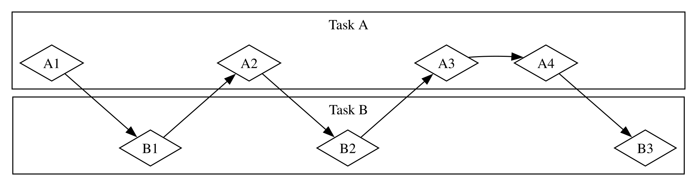

# 非同期プログラミングの基礎：Async、Await、Future、Stream

コンピュータに依頼する処理の多くは、完了までに時間がかかります。時間のかかる処理を待つ間に、別のこともできれば便利です。現代のコンピュータには、複数の処理を同時に進めるための技法が2つあります。並列性（parallelism）と並行性（concurrency）です。しかし、プログラムのロジックは、たいてい直線的な流れとして記述します。コードの各部分を実行する順序や方法をあらかじめ細かく指定しなくても、プログラムが行う処理と、関数を一時停止して別の処理を実行できる地点を指定できるのが理想です。*非同期プログラミング*（asynchronous programming）は、停止する可能性のある地点と最終的に得られる結果という形でコードを表現し、処理同士の調整を引き受けてくれる抽象化です。

第16章では、スレッドを使って並列性と並行性を実現しました。この章では、それとは別のコードの書き方を紹介します。RustのFutureとStream、処理を非同期に実行できることを表す`async`と`await`構文、そして非同期処理の実行を管理・調整するコードである*非同期ランタイム*を実装した外部クレートについて学びます。

例を考えてみましょう。家族のお祝いを撮影した動画を書き出すとします。この処理には数分から数時間かかることがあります。動画の書き出しは、利用できるCPUとGPUの能力を可能な限り使います。CPUコアが1つしかなく、書き出しが終わるまでOSが処理を中断しない、つまり書き出しを*同期的に*（synchronously）実行するなら、その間はコンピュータで何もできません。かなり困るでしょう。幸い、実際のOSは書き出し処理を目に見えない形で十分な頻度で中断し、同時に別の作業もできるようにします。

次に、誰かが共有した動画をダウンロードするとします。これも時間はかかりますが、CPU時間はそれほど使いません。この場合、CPUはネットワークからデータが届くのを待つ必要があります。データが届き始めれば読み込みを開始できますが、すべて届くまでには時間がかかるかもしれません。すべて届いた後でも、動画がかなり大きければ、全体を読み込むだけで1〜2秒以上かかることがあります。短く聞こえるかもしれませんが、毎秒数十億回の演算を行える現代のプロセッサにとっては非常に長い時間です。この場合もOSはプログラムを目に見えない形で中断し、ネットワーク処理の完了を待つ間にCPUが別の仕事をできるようにします。

動画の書き出しは、*CPUバウンド*または*計算バウンド*な処理の例です。処理速度は、CPUやGPUがデータを処理できる速さと、その能力をどれだけ処理に割り当てられるかによって制限されます。動画のダウンロードは、コンピュータの*入力と出力*の速さ、つまりネットワーク上をデータが送られてくる速さに制限されるため、*I/Oバウンド*な処理の例です。

どちらの例でも、OSによる見えない中断が一種の並行性をもたらしています。ただし、この並行性はプログラム全体の単位でしか働きません。OSがあるプログラムを中断し、別のプログラムに処理を進めさせるからです。多くの場合、私たちはOSより細かな単位で自分のプログラムを理解しているため、OSには見えない並行処理の機会を見つけられます。

たとえば、ファイルのダウンロードを管理するツールを作るなら、1件のダウンロードを始めてもUIが固まらず、利用者が同時に複数のダウンロードを開始できるようにしたいでしょう。しかし、ネットワークを扱うOSのAPIの多くは*ブロッキング*です。つまり、処理対象のデータが完全に準備できるまでプログラムの進行を止めます。

> 注：考えてみれば、*ほとんどの*関数呼び出しはこのように動作します。ただし、*ブロッキング*という言葉は通常、ファイル、ネットワーク、その他のコンピュータ資源とやり取りする関数呼び出しに使われます。このような処理では、個々のプログラムが*ノンブロッキング*であることから特に大きな恩恵を受けるためです。

ファイルごとに専用スレッドを生成すれば、メインスレッドがブロックされるのを避けられます。しかし、スレッドが使用するシステム資源のオーバーヘッドは、いずれ問題になります。そもそも呼び出しがブロックしないほうが望ましいでしょう。プログラムに完了してほしい複数のタスクを定義し、それらを実行する最適な順序と方法をランタイムに選ばせられればよいのです。

Rustの*async*（*asynchronous*の略）という抽象化は、まさにそれを実現します。この章では、次の内容を通してasyncを詳しく学びます。

- Rustの`async`と`await`構文を使い、非同期関数をランタイムで実行する方法
- 第16章で扱った課題のいくつかを、非同期モデルで解決する方法
- マルチスレッドとasyncが互いを補完する解決策となり、多くの場合に組み合わせられること

ただし、asyncが実際にどう動くかを見る前に、並列性と並行性の違いを少し詳しく確認しておく必要があります。

## 並列性と並行性

ここまでは、並列性と並行性をほぼ同じ意味で扱ってきました。これから実際に非同期処理を扱うと両者の違いが現れるため、ここでより正確に区別します。

ソフトウェアプロジェクトの仕事をチームで分担する方法を考えてみましょう。1人に複数のタスクを割り当てる方法、各メンバーに1つずつタスクを割り当てる方法、そして両者を組み合わせる方法があります。

1人が、どれも完了していない複数のタスクを切り替えながら進めることが*並行性*です。これは、コンピュータ上に2つの別々のプロジェクトをチェックアウトしておき、一方に飽きたり行き詰まったりしたら、もう一方へ切り替える方法に似ています。作業者は1人なので、まったく同じ瞬間に両方を進めることはできません。それでもタスク間を切り替え、1つずつ進めることで複数の仕事を扱えます（図17-1）。

<figure>

<figcaption>図17-1：タスクAとタスクBを切り替える並行ワークフロー</figcaption>

</figure>

一方、チーム内でタスク群を分け、各メンバーが1つのタスクを担当して個別に作業することが*並列性*です。各メンバーは、まったく同じ時間に作業を進められます（図17-2）。

<figure>

<figcaption>図17-2：タスクAとタスクBを互いに独立して進める並列ワークフロー</figcaption>

</figure>

どちらの進め方でも、異なるタスク間の調整が必要になることがあります。ある人に割り当てたタスクは他の作業から完全に独立していると思っていたのに、実際には別のメンバーが先に自分のタスクを終える必要があるかもしれません。一部は並列に進められても、別の部分は実は*直列*であり、図17-3のように1つのタスクが終わってから次のタスクへ進む必要があります。

<figure>

<figcaption>図17-3：タスクAとタスクBを独立して進められるものの、A3がB3の結果を待ってブロックされる、一部だけが並列なワークフロー</figcaption>

</figure>

同じように、自分のタスクの1つが、自分の別のタスクに依存していると分かることもあります。この場合、並行していた自分の作業にも直列な部分が生まれます。

並列性と並行性は互いに影響することもあります。同僚が、自分のタスクの1つが終わるまで先へ進めないと分かったら、そのタスクへ全力を注いで同僚の「ブロックを解除」しようとするでしょう。その間、あなたと同僚は並列に作業できず、あなた自身も複数のタスクを並行して進められなくなります。

ソフトウェアとハードウェアにも、同じ基本的な関係があります。CPUコアが1つのマシンでは、CPUは一度に1つの処理しか実行できませんが、それでも並行して仕事を進めることはできます。スレッド、プロセス、asyncなどの仕組みを使えば、コンピュータは1つの処理を一時停止して別の処理へ切り替え、後で最初の処理へ戻れます。CPUコアが複数あるマシンでは、並列処理も可能です。あるコアが1つのタスクを処理しているのと同時に、別のコアがまったく関係のないタスクを処理できます。

Rustの非同期コードは、通常は並行に実行されます。使用するハードウェア、OS、非同期ランタイム（これについてはすぐ後で説明します）によっては、その並行処理が内部で並列性も利用することがあります。

それでは、Rustの非同期プログラミングが実際にどのように動くのかを見ていきましょう。

> **C言語との比較**
>
> C言語で同じ課題を扱う場合、OSスレッド、`select`／`poll`／`epoll`などのI/O多重化、コールバック、イベントループを直接組み合わせることがよくあります。Rustのasyncも最終的には同種のOS機能を利用しますが、待機中の処理状態をFutureという値で表し、所有権と型による検査を保ったまま合成できる点が大きな違いです。asyncは「自動的に並列化する機能」ではなく、処理を止めずに待ち時間を活用するための仕組みだと捉えてください。
